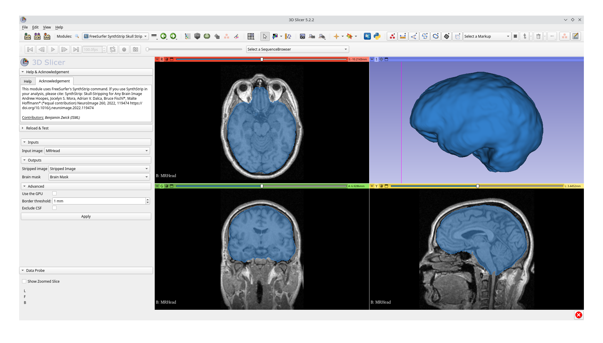
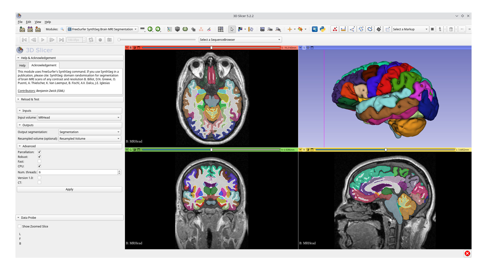

# Slicer FreeSurfer Commands

Run [FreeSurfer](https://freesurfer.net) commands using [3D Slicer](https://www.slicer.org)'s graphical user interface.

Features include:
- segmentation (SynthSeg)
- skull stripping (SynthStrip)

FreeSurfer SynthStrip Skull Strip

FreeSurfer SynthSeg Brain MRI Segmentation

## Modules

The FreeSurfer Commands extension for 3D Slicer contains the following modules:

- **(TODO) FreeSurfer MRI Watershed Skull Strip:** Skull stripping using FreeSurfer's [MRI watershed (FSW) algorithm](https://surfer.nmr.mgh.harvard.edu/fswiki/mri_watershed).

- **[FreeSurfer SynthSeg Brain MRI Segmentation](FreeSurferSynthSeg):** Brain MRI segmentation using [SynthSeg](https://github.com/BBillot/SynthSeg) packaged in [FreeSurfer](https://surfer.nmr.mgh.harvard.edu/fswiki/SynthSeg).

- **[FreeSurfer SynthStrip Skull Strip (CLI)](FreeSurferSynthStripSkullStrip):** Skull stripping using FreeSurfer's [SynthStrip](https://surfer.nmr.mgh.harvard.edu/docs/synthstrip) tool implemented as a Python CLI module.

- **[FreeSurfer SynthStrip Skull Strip (Scripted)](FreeSurferSynthStripSkullStripScripted):** Skull stripping using FreeSurfer's [SynthStrip](https://surfer.nmr.mgh.harvard.edu/docs/synthstrip) tool implemented as a Python scripted module.

## Installation

You must have FreeSurfer (version 7.3.2 or higher) installed on your computer
and have the `$FREESURFER_HOME` environment variable set correctly.
Please refer to the [FreeSurfer](https://freesurfer.net) documentation for further details.

The FreeSurfer Commands extension for 3D Slicer has been tested on the following operating systems:
- Debian GNU/Linux 12 (bookworm) with 3D Slicer 5.2.2

## Feature Requests

Please open an [issue](https://github.com/SlicerCBM/SlicerFreeSurferCommands/issues) if you would like to suggest a new feature or FreeSurfer command to be added.

## Contributing

Pull requests are welcome.
For major changes, please open an [issue](https://github.com/SlicerCBM/SlicerFreeSurferCommands/issues) first to discuss what you would like to change.
